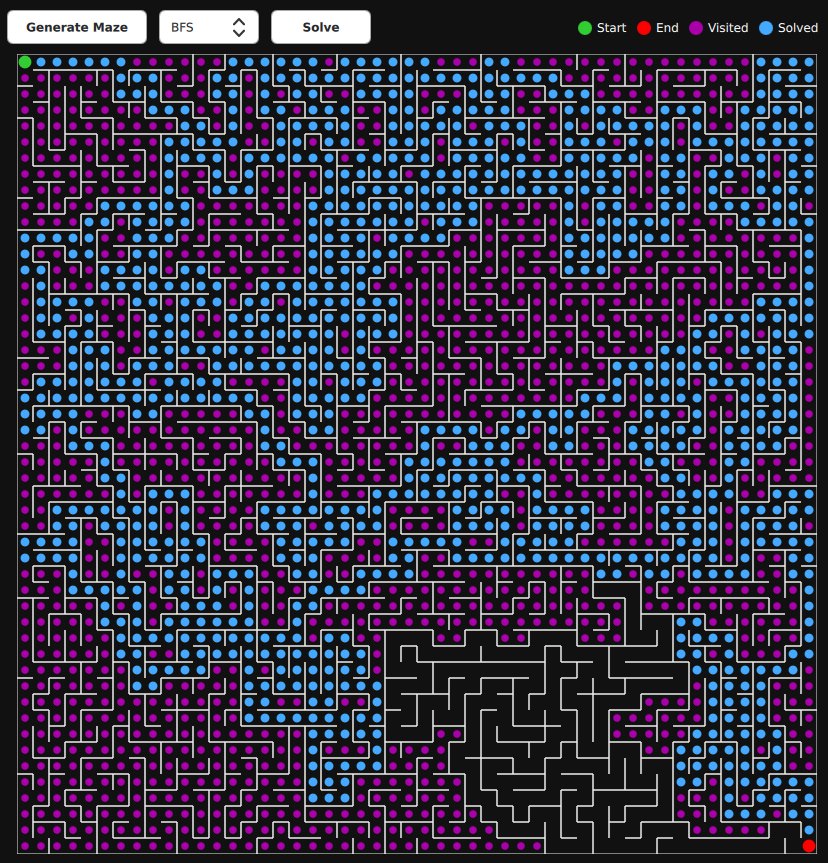

# 🌀 MazeMVVM — Maze Generator and Solver (Qt + QML + MVVM)

A modern **Maze Generator and Solver** built with **Qt 5.15** and **Qt Quick Controls 2**, using an **MVVM (Model–View–ViewModel)** architecture.  
The application generates a *perfect maze* using a **Depth-First Search (DFS)** backtracker algorithm and solves it using **DFS** or **Breadth-First Search (BFS)**.

---

## 🚀 Features
- 🧱 **Maze Generation** using recursive backtracking (DFS)
- 🧩 **Maze Solving** using:
  - Depth-First Search (DFS)
  - Breadth-First Search (BFS)
- 🧠 **MVVM Architecture**
  - `MazeModel` (logic)
  - `MazeViewModel` (data binding)
  - `MazeView.qml` (UI visualization)
- 🎨 **Qt Quick Canvas Rendering**
  - Draws maze walls, visited path (yellow), solved path (blue)
  - Start (green) and End (red) points
---

### Requirements
- **Qt 5.15** or later
- **CMake 3.16+**
- **C++17** compiler

